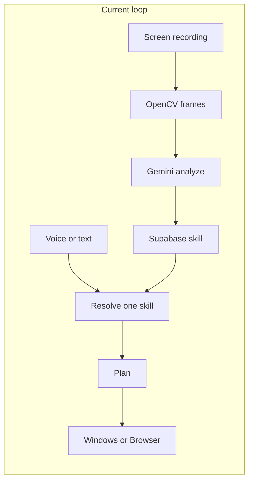

# CopyCat phase-wise build plan

## What already works

The core loop is live. Do not rebuild it.

```text
Teach (upload video)
  → OpenCV frames every 1s
  → Gemini extracts goal + candidate skill
  → Supabase skills (pending → accept/reject)
  → User says/types a command
  → resolve ONE skill → plan → Windows or Browser executor
  → execution_history
```

**Backend (FastAPI + Gemini + Supabase)**

- Teach pipeline: `[backend/src/backend/main.py](backend/src/backend/main.py)` `POST /upload-video` → `[video/processor.py](backend/src/backend/video/processor.py)` → `[ai/gemini.py](backend/src/backend/ai/gemini.py)`
- Skills CRUD + accept/reject in `[storage/skills.py](backend/src/backend/storage/skills.py)` (`skills` table, **no `user_id`**)
- Execute: `[ai/skill_resolver.py](backend/src/backend/ai/skill_resolver.py)` picks **one** skill → `[ai/planner.py](backend/src/backend/ai/planner.py)` → `[executors/router.py](backend/src/backend/executors/router.py)` (Windows file ops in a sandbox workspace, or Playwright/ADK browser agent)
- Gemini 429 retry only, **single key**: `[ai/retry.py](backend/src/backend/ai/retry.py)`
- Desktop Gemini Live voice exists (`[voice/live_agent.py](backend/src/backend/voice/live_agent.py)`) but is **not** the web product. Frontend uses Chrome Web Speech API (STT only). **Sarvam is not present.**

**Frontend (Next.js 16 + Tailwind)**

- Landing + app shell: Dashboard, Teach, My Skills, Activity, Settings (stub)
- Teach + skill review + live skills/activity lists
- Dashboard voice box is wired to `POST /execute`, but `[VoiceCommand.tsx](frontend/src/components/app/VoiceCommand.tsx)` is internally inconsistent (missing import / undefined vars), and dashboard previews are still **sample data**
- No chat, no multi-chat sidebar, no auth, no user profiles
- `[frontend/src/lib/api.ts](frontend/src/lib/api.ts)` has **duplicated** client functions — clean this before adding more endpoints

**Identity assumption for the demo:** there is no auth. New tables should include `user_id`, defaulting to a single demo user (e.g. `demo`) so Auth can plug in later without a schema rewrite.



---

## Phase 0 — Stabilize the existing loop (0.5 day)

Unblocks every later phase. No new product features.

- Fix `[VoiceCommand.tsx](frontend/src/components/app/VoiceCommand.tsx)`: import `useSearchParams` and `Badge`, define `resolved_skill` / `running` / `errorMessage` / `submittedCommand`, and add `no-match` / `error` to the state union so the dashboard actually runs.
- Restore the TeachSuccess `?command=` deep-link so “try saying this” lands on the dashboard with the command filled.
- Deduplicate `[frontend/src/lib/api.ts](frontend/src/lib/api.ts)` into one client (duplicate exports of `getSkills`, `executeCommand`, and related types).
- Replace dashboard sample activity/skills with `GET /skills` and `GET /execution-history`.
- Declare `tenacity` in `[backend/pyproject.toml](backend/pyproject.toml)` — `[ai/retry.py](backend/src/backend/ai/retry.py)` already imports it via a transitive dep.
- Confirm the demo path end-to-end: teach one Windows skill + one browser skill → accept → run from mic and from text.

**Done when:** a judge can teach, accept, and re-run a skill without hitting a frontend crash.

---

## Phase 1 — Gemini key fallback + response format (0.5 day)

You listed these separately; they share the Gemini client and should ship together.

**Key fallback**

- Env: `GEMINI_API_KEY`, `GEMINI_API_KEY_2`, `GEMINI_API_KEY_3` (comma-separated `GEMINI_API_KEYS` is also fine).
- Centralize client creation (today each of `[gemini.py](backend/src/backend/ai/gemini.py)`, `[skill_resolver.py](backend/src/backend/ai/skill_resolver.py)`, `[planner.py](backend/src/backend/ai/planner.py)`, `[browser_agent.py](backend/src/backend/executors/browser_agent.py)`, `[live_agent.py](backend/src/backend/voice/live_agent.py)` reads one key).
- On 429 / 403 / quota after existing retries, rotate to the next key and retry once. Do not rotate on 400/validation errors.
- Surface a calm 503 if every key is exhausted.

**Response format (text / voice)**

Every user-facing reply (execute, later chat) should return:

```json
{
  "text": "Full UI message with skill names and outcome.",
  "speakable": "One short spoken sentence.",
  "modality": "text | voice"
}
```

- `text` is what the chat/result card shows.
- `speakable` is what TTS reads. Keep it short.
- `modality` is `voice` when the request came from the mic, else `text`.

Wire this through `[command_bridge.py](backend/src/backend/voice/command_bridge.py)` and `POST /execute` so Phase 4 only has to play audio.

**Done when:** killing the first key still completes a command, and the UI shows a written result plus a short speakable line.

---

## Phase 2 — Combined skill calling (1 day)

Highest-leverage demo feature. Resolver today is explicit: “Find the **single** best matching skill.”

**Change the contract, not the executors.**

1. Update `[skill_resolver.py](backend/src/backend/ai/skill_resolver.py)` to return `skills: [{skill_id, parameters, order}]` plus `reasoning`. Allow 1–N accepted skills. Do not invent skills.
2. Add a thin orchestrator (new `ai/orchestrator.py` or extend `POST /execute`):

- Plan each resolved skill with the existing planner.
- Run them **in order**.
- If one fails, stop and report which step failed.
- Merge results into one `text` / `speakable` response.

3. Prompt Gemini with 3–4 composition examples: “organize these files **then** open the folder”, “fill the form **and** submit”, “download the file **then** move it into Projects”.
4. Frontend: result card lists each skill that ran (`Organize semester files` → `Open workspace`).

**Test before the demo (do this as a script, not only in the UI):**

- Two Windows skills composed
- Browser + Windows composed
- Ambiguous command → one skill or none (must not hallucinate a third)

**Done when:** “Do A then B” runs two accepted skills in sequence and the UI names both.

---

## Phase 3 — Chat context + multi-chat UI (1.5 days)

Today there is no conversation — each command is stateless. This is the product surface the demo should live on.

**Supabase**

- `chats`: `id`, `user_id`, `title`, `compacted_summary` (text, nullable), `created_at`, `updated_at`
- `chat_messages`: `id`, `chat_id`, `role` (`user` | `assistant`), `content`, `speakable`, `modality`, `resolved_skill_ids` (jsonb), `created_at`

**Context rule**

- Send the last **10 messages** plus `compacted_summary` into Gemini on every turn.
- When a chat exceeds 10 messages, compact the older ones into `compacted_summary` (one Gemini call: 4–6 sentences of user intent, preferences, last outcomes). Keep the newest 10 raw.

**API**

- `GET /chats`, `POST /chats`, `GET /chats/{id}/messages`
- `POST /chats/{id}/message` `{ content, modality }` → run resolve/orchestrate/execute → persist user + assistant rows → return formatted response
- Keep `POST /execute` for one-shot runs; chat is the new primary path

**UI (ChatGPT-style, still CopyCat)**

- Dashboard becomes a conversation: history above, mic + text at the bottom.
- Sidebar: chat list + **New chat** button. Clicking a chat loads its messages.
- Auto-title from the first user message (truncate, or a cheap Gemini title).
- Reuse existing result badges (skill name, environment, success) inside assistant bubbles.

**Done when:** two chats stay separate, a 12th message still has useful context, New chat starts clean.

---

## Phase 4 — Voice integration with Sarvam AI (1 day)

Voice is “first” in the UI, but STT is Chrome-only and there is no TTS. Gemini Live is a local PyAudio session — leave it as a backend experiment; do not demo it.

**Web path (this is the demo):**

```text
Mic audio
  → Sarvam STT
  → POST /chats/{id}/message  (modality=voice)
  → text bubble + speakable
  → Sarvam TTS playback
```

- New thin backend routes or Next route handlers: `POST /voice/transcribe`, `POST /voice/speak` (keys stay server-side).
- Replace Web Speech API in `[VoiceCommand.tsx](frontend/src/components/app/VoiceCommand.tsx)` with MediaRecorder → Sarvam. Keep typed input as fallback.
- Play TTS only when `modality === "voice"`. Never auto-speak typed commands.
- Listening / running / speaking states must be obvious.

If Sarvam is late, keep Chrome STT for input and still speak `speakable` via any available TTS — the response contract from Phase 1 still holds.

**Done when:** a spoken command runs a skill and CopyCat answers out loud with a short sentence while the full text stays on screen.

---

## Phase 5 — Form-filling skill detection (1 day)

The browser executor can already type. What is missing is **recognizing** a demonstration as a form-fill workflow and storing field-level structure.

- Extend the analysis prompt in `[ai/gemini.py](backend/src/backend/ai/gemini.py)`: if the recording is filling a web form, emit `skill_type: "form_fill"` and steps like `{ action: "fill_field", observed_data: { label, value_kind, example_value } }`.
- Optional column or jsonb on `skills`: `skill_type` (`form_fill` | `file_ops` | `browser_task` | `other`).
- Resolver/orchestrator: a command like “fill the internship application with my details” should prefer a `form_fill` skill and pull values from the command, chat summary, and (Phase 7) profile.
- Teach UI: if `skill_type === form_fill`, show “Form fields CopyCat noticed” instead of generic steps.

UI-DETR-1 ([racineai/UI-DETR-1](https://huggingface.co/racineai/UI-DETR-1)) can label input boxes on frames **before** Gemini runs, which makes field detection more reliable. If the model is heavy for the laptop, ship Gemini-only detection first and add boxes in Phase 6.

**Demo tape:** record filling a public form (name, email, dropdown, submit) → accept → “Fill that form for Jane Doe, [jane@email.com](mailto:jane@email.com)”.

**Done when:** a form-fill recording becomes a typed skill and a parameterized command fills different values.

---

## Phase 6 — Privacy with UI-DETR (1 day)

Frames today go to Gemini **unredacted**. Privacy is a trust story for the demo, not a rewrite of teach.

Insert a redact step in `[video/processor.py](backend/src/backend/video/processor.py)` **after** extract, **before** `analyze_frames`:

1. Run UI-DETR-1 on each frame → UI boxes (inputs, buttons, text).
2. Treat password / email / phone / ID-looking regions as sensitive (heuristic on nearby labels, or a small PII pass). Opaque black boxes, not blur.
3. Send **redacted** frames to Gemini. Keep originals on disk only if needed for local review; do not upload them.
4. Settings (currently a stub): “Hide personal details in recordings” toggle, on by default.
5. Teach processing UI: “Privacy filter applied — personal fields hidden before analysis.”

If UI-DETR is too slow on CPU, redact only every Nth frame or downscale first. Do not block teach if the model fails — log and continue, and say so in the UI.

**Done when:** a recording with an email/password field produces a skill, and the frames Gemini saw have those regions covered.

---

## Phase 7 — User profiles from activity (0.5–1 day)

No profiles exist. Build them from data you already store.

**Table `user_profiles`**

- `user_id`
- `display_name`
- `known_facts` jsonb — name, email, preferred folders, recurring form values (only what the user taught or typed)
- `preferred_skills` — most-used accepted skills
- `updated_at`

**How it fills**

- After each successful execution, a small Gemini pass updates `known_facts` from the command + result (e.g. “always put PDFs in Semester/Notes”).
- After each accepted teach, add the skill’s domain (Gmail, File Explorer, a named form).
- Chat compact (Phase 3) should read/write this profile so “use my usual details” works.

**UI:** Settings or a small Profile card — “CopyCat remembers” list, with a clear **Forget** action. Do not silently store secrets (passwords stay out of the profile).

**Done when:** a second form-fill command can reuse a name/email the user already gave in chat, without asking again.

---

## Phase 8 — Demo polish (half day)

- One-page demo script: teach → accept → “do it again” → “do A then B” → spoken reply → show redacted frame → show profile fact.
- Empty/error states for no skills, Gemini down, Sarvam down.
- Landing “Try it out” already goes to `/app` — leave landing alone.
- Do **not** start auth, theme switching, or analysis-history pages from the old spec. They are not the demo.

---

## Suggested order vs. what to cut

Build in this order. If time runs out, cut from the bottom.

1. Phase 0 — broken dashboard / API client
2. Phase 1 — keys + response shape
3. Phase 2 — combined skills (the wow)
4. Phase 3 — chats (the product)
5. Phase 4 — Sarvam (voice-first claim)
6. Phase 5 — form-fill (usecase)
7. Phase 6 — privacy (trust slide)
8. Phase 7 — profiles (smarter follow-ups)
9. Phase 8 — polish

**Must ship for a coherent demo:** 0, 1, 2, and either 3 or 4 (chat _or_ spoken replies). Form-fill, privacy, and profiles are stronger if 2–4 already work.

---

## What not to rebuild

- Landing page and design system
- Teach upload / accept / reject / edit
- Windows workspace executor and browser ADK executor
- Supabase `skills` and `execution_history`
- Old FRONTEND_SPEC phases 1–9 (already implemented under different route names)

Gemini Live + PyAudio (`[backend/src/backend/voice/](backend/src/backend/voice/)`) stays optional. The demo voice path is **browser → Sarvam → same skill pipeline**.
